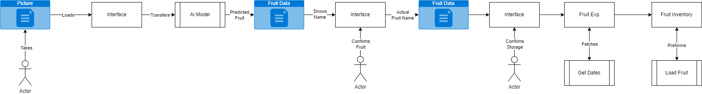
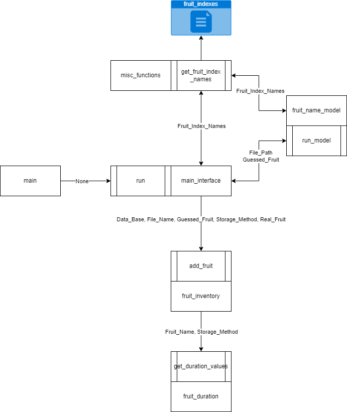

# 1. Executive Summary
“What is not measured cannot be improved” once said by Lord Kelvin. Describes the fundamental believe of this project. Families throw away health fruits and vegetables daily. [Missouri Dept. of Natural Resources](https://dnr.mo.gov/waste-recycling/reduce-reuse-recycle/what-to-do-with-specific/food) estimates that 30-40% of all food goes uneaten within the United States. On top of that food prices since 2019 have increased more than 25% per [US Dept. of Agriculture](https://www.ers.usda.gov/data-products/ag-and-food-statistics-charting-the-essentials/food-prices-and-spending/?topicId=1afac93a-444e-4e05-99f3-53217721a8be). This increasing in cost and high waste creates an opportunity for a database software to track food bought within the household. This project helps to enable others to track fruits and vegetables. 

# The problem being fixed.
This program will provide an interface to track food entering into a household. Their will be an added element of artificial intelligence to understand how to integrate it into a data pipeline. 

## High-level Benefits and objectives
Allow for photos of fruits and vegetables to be processed by a AI framework. This framework will make a predicted guess and ask for user feedback to be used for further training. As time progress and more data is collected the program will reduce the toil of entering the food items and allow for a easier to use tracking system.  

### Functional Requirements
* Cross Platform 
* Easy To Use
* Able To Correct Entries
* Able to enter pictures into the program

### Non-Functional Requirements
* Whole AI Pipeline must run within One Minute.
* Must be able to run on a light weight compute device (Raspberry Pi 4 will be the benchmark.)

## Intended audience and key stakeholders
### Stakeholders
| Name           | Role    |
| --------       | ------- |
| Bobby Houston  | Lead    |
| Deepti Manglik | Reviewer|
# 2. Introduction

## 2.1 Background information on the problem or need.
In recent years AI tools have been created within the programming space to act as a black box for image classification as such this project will treat the training of the model as a black box and use example code from the [tensorflow](https://www.tensorflow.org/tutorials/images/classification) website.

Along side that databases have been critical into IT for many years. Some notable databases include database 2 (DB2), Oracle, SQL, and PostgreSQL. As such this project will also focus on the deployment and creation of one of these databases. The 1st attempt focused on MySQL however, setting up the database would require a external API between that and the program. Due to later on requirements this was dropped in favor of sqlite3. This allowed for different programming designs to take place.

Programming designs explored with microservices and tightly coupled codes. Tightly coupling makes the other parts of the code heavily depend on other code functions but allows for faster processing normally. Where microservices allows for faster deployment and is common in cloud platforms at the cost of more resources consumed. 

PaaS was lastly explored with a part of the application being ran in a container service. Containers goal is to stop the well it works on my machine problem. This is preformed by running the code inside the OS instead of creating a new virtual machine. This deployment method has become largely popular in cloud computing with the start up time of new services often less than a minute. 

## 2.2 Project Objectives for the creator.
High level understanding when to use containers, different coding patterns, when to use a database, and how to deploy an AI pipeline. 

## 2.3 Architectural Decisions

#### Architectural Decision 1
**Programming Language**

**Description**:
Python, C++, and Java are the top languages in this space.\ 
**Pro/Cons**:
| Issue                                   | Winner          |
| --------                                | -------         |
| Cross Platform                          | Python & Java   |
| Popularity                              | Python          |
| Security                                | Java            |
| Speed                                   | c++             |

**Conclusion**:\
Python

#### Architectural Decision 2
**Container Software**

**Description**:
Docker and Podman where the two different container based platforms looked at.\
**Pro/Cons**:
| Issue                                   | Winner    |
| --------                                | -------   |
| Runs on Raspberry Pi, Mac OS and Windows| Docker    |
| Popularity                              | Docker    |
| Security                                | Podman    |

**Conclusion**:\
Docker
#### Architectural Decision 3
**AI Framework**

**Description**:
PyTorch and Tensorflow were the two major frameworks looked into.\
**Pro/Cons**:
| Issue                                   | Winner         |
| --------                                | -------        |
| Data Visualization                      | Tensorflow     |
| Ease of Use                             | PyTorch        |
| Written in Python                       | Tensorflow     |

**Conclusion**:\
Tensorflow

#### Architectural Decision 4
**Database Used**

**Description**:
MySQL or python's native support for sqlite3 module.\
**Pro/Cons**:
| Issue                                   | Winner         |
| --------                                | -------        |
| Ease of Use                             | sqlite3        |
| Industry Standard                       | MySQL          |
| Mobile                                  | sqlite3        |

**Conclusion**:\
sqlite3

#### Architectural Decision 5
**Interface**

**Description**:
Tkinter can create a GUI. While Flask allows for API web development.\
**Pro/Cons**:
| Issue                                   | Winner         |
| --------                                | -------        |
| User Ease of Use.                       | Flask          |
| Industry Standard                       | Flask          |
| Development time                        | Tkinter          |

**Conclusion**:\
tkinter

# 3. Objectives and Goals

## Specific objectives the solution aims to achieve.
* Provide a easy user interface.
* Make best effort to guess fruit.
* Provide best effort to give a date to use by.

## Success criteria and measurable goals.
* User can enter a new fruit or vegetable with in 30-45 seconds.
* AI component makes a guess and tracks accuracy.
* Database provides use by date allowing for users to track when to use fruit by.

# 4. Solution Overview

## Dataflow of user interface.

## Key components and architecture.

## How the solution addresses the problem.
This solution creates a tracking method to help users find food that needs to be consumed that week.

# 5. Technical Requirements

## Hardware Tested On:
* M1 Macbook Air
* Windows 11 AMD CPU & GPU
* Windows 11 Intel CPU & Nvidia GPU
* Raspberry PI 4

## Software Needed
* [Docker](https://www.docker.com/)
* [Python](https://www.python.org/)

## Python Modules used
* [tensorflow](https://www.tensorflow.org)
* [matplotlib](https://matplotlib.org/)
* [numpy](https://numpy.org/)
* [pillow](https://python-pillow.org/)
* [pandas](https://pandas.pydata.org/)
* [openpyxl](https://openpyxl.readthedocs.io/en/stable/)

# 6. Deployment Plan

## Tools to Install
1. [Install Visual Studio Code](https://code.visualstudio.com/download)
2. [Install GitHub](https://desktop.github.com/download/)
3. [Install Python](https://www.python.org/downloads/)
4. [Install Docker](https://docs.docker.com/engine/install/)

## Visual Studio Code Extensions
1. Code Spell Checker
2. Dev Containers
3. Docker
4. Github Copilot
6. IntelliCode
7. Jupyter
8. Prettier
9. Python
10. WSL

## How to quickly install python modules
1. Open code directory in VScode
2. On Windows/Linux press control+shift+p on mac press command+shift+p
3. Click on venv environment, this will create a virtual python environment
4. Click on requirements.txt, this will use that file to gather all the modules outline in technical requirements.
5. Find the file called main.py and click run

## How to use the program 
1. Upload allows you to load a jpg picture into the AI model
2. If it guesses the correct fruit/vegetable once the user clicks yes it will change the correct fruit
3. Then you can call the storage method.
4. Then submit will load it into the database.
5. On close it will ask the user to save the database to csv and open excel. 

## Docker Deploy
1. The code comes with a docker file. 
2. Once the user right clicks on the docker file with the correct extensions they can deploy the docker container.
3. It will then fetch the image in test and guess what the file is. 

# 7. Sources Used
## Code Examples:
1. [tensorflow](https://www.tensorflow.org/tutorials/images/classification)
2. [SQLite3](https://www.geeksforgeeks.org/python-sqlite/)
3. [Docker](https://www.docker.com/blog/how-to-dockerize-your-python-applications/)

## Expiration Sources
1. Apple
* [Counter](https://www.healthline.com/nutrition/how-long-do-apples-last)
* [Pantry](https://www.healthline.com/nutrition/how-long-do-apples-last)
* [Refrigerator](https://www.healthline.com/nutrition/how-long-do-apples-last)
* [Freezer](https://www.healthline.com/nutrition/how-long-do-apples-last)
2. Banana
* [Counter](https://www.glad.com/wp-content/uploads/2020/05/GladUC_HowtoFreezeStoreBananas.pdf)
* [Pantry](https://www.glad.com/wp-content/uploads/2020/05/GladUC_HowtoFreezeStoreBananas.pdf)
* [Refrigerator](https://www.glad.com/wp-content/uploads/2020/05/GladUC_HowtoFreezeStoreBananas.pdf)
* [Freezer](https://www.glad.com/wp-content/uploads/2020/05/GladUC_HowtoFreezeStoreBananas.pdf)
3. Beetroot
* [Counter](https://www.canr.msu.edu/uploads/236/61444/Beets.pdf)
* [Pantry](https://www.canr.msu.edu/uploads/236/61444/Beets.pdf)
* [Refrigerator](https://www.canr.msu.edu/uploads/236/61444/Beets.pdf)
* [Freezer](https://www.canr.msu.edu/uploads/236/61444/Beets.pdf)
4. Bell Pepper
* [Counter](https://www.yahoo.com/lifestyle/long-bell-peppers-last-fridge-124114170.html)
* [Pantry](https://www.yahoo.com/lifestyle/long-bell-peppers-last-fridge-124114170.html)
* [Refrigerator](https://www.yahoo.com/lifestyle/long-bell-peppers-last-fridge-124114170.html)
* [Freezer](https://www.eatingwell.com/article/7966561/can-you-freeze-bell-pepper/)
5. Cabbage
* [Counter](https://cedarcirclefarm.org/tips/entry/cabbage-using-storing)
* [Pantry](https://cedarcirclefarm.org/tips/entry/cabbage-using-storing)
* [Refrigerator](https://cedarcirclefarm.org/tips/entry/cabbage-using-storing)
* [Freezer](https://itsavegworldafterall.com/how-to-freeze-cabbage/)
6. Capsicum, is this just a bell pepper?
* [Counter](https://www.yahoo.com/lifestyle/long-bell-peppers-last-fridge-124114170.html)
* [Pantry](https://www.yahoo.com/lifestyle/long-bell-peppers-last-fridge-124114170.html)
* [Refrigerator](https://www.yahoo.com/lifestyle/long-bell-peppers-last-fridge-124114170.html)
* [Freezer](https://www.eatingwell.com/article/7966561/can-you-freeze-bell-pepper/)
7. Carrot
* [Counter](https://www.glad.com/wp-content/uploads/2020/05/GladUC_HowtoFreezeStoreCarrots-1.pdf)
* [Pantry](https://www.glad.com/wp-content/uploads/2020/05/GladUC_HowtoFreezeStoreCarrots-1.pdf)
* [Refrigerator](https://www.glad.com/wp-content/uploads/2020/05/GladUC_HowtoFreezeStoreCarrots-1.pdf)
* [Freezer](https://www.glad.com/wp-content/uploads/2020/05/GladUC_HowtoFreezeStoreCarrots-1.pdf)
8. Cauliflower
* [Counter](https://www.mccormick.com/articles/eatingwell/how-to-store-cauliflower)
* [Pantry](https://www.mccormick.com/articles/eatingwell/how-to-store-cauliflower)
* [Refrigerator](https://www.mccormick.com/articles/eatingwell/how-to-store-cauliflower)
* [Freezer](https://www.mccormick.com/articles/eatingwell/how-to-store-cauliflower)
9. Chilli Pepper
* [Counter](https://fridge.com/blogs/news/how-long-does-chili-pepper-last-in-the-fridge)
* [Pantry](https://fridge.com/blogs/news/how-long-does-chili-pepper-last-in-the-fridge)
* [Refrigerator](https://fridge.com/blogs/news/how-long-does-chili-pepper-last-in-the-fridge)
* [Freezer](https://fridge.com/blogs/news/how-long-does-chili-pepper-last-in-the-fridge)
10. Corn
* [Counter](https://www.southernliving.com/food/veggies/corn/how-to-store-corn-on-the-cob)
* [Pantry](https://www.southernliving.com/food/veggies/corn/how-to-store-corn-on-the-cob)
* [Refrigerator](https://www.southernliving.com/food/veggies/corn/how-to-store-corn-on-the-cob)
* [Freezer](https://extension.umn.edu/preserving-and-preparing/freezing-sweet-corn-whole-kernels)
11. Cucumber
* [Counter](https://www.masterclass.com/articles/how-to-keep-cucumbers-fresh-explained)
* [Pantry](https://www.masterclass.com/articles/how-to-keep-cucumbers-fresh-explained)
* [Refrigerator](https://www.masterclass.com/articles/how-to-keep-cucumbers-fresh-explained)
* [Freezer](https://www.masterclass.com/articles/freezing-cucumber-explained)
12. Eggplant
* [Counter](https://www.allrecipes.com/article/how-to-store-eggplant/)
* [Pantry](https://www.allrecipes.com/article/how-to-store-eggplant/)
* [Refrigerator](https://www.allrecipes.com/article/how-to-store-eggplant/)
* [Freezer](https://www.realsimple.com/can-you-freeze-eggplant-7559801)
13. Garlic
* [Counter](https://www.allrecipes.com/article/how-to-store-garlic/)
* [Pantry](https://www.allrecipes.com/article/how-to-store-garlic/)
* [Refrigerator](https://www.allrecipes.com/article/how-to-store-garlic/)
* [Freezer](https://www.marthastewart.com/2123790/how-store-garlic)
14. Ginger
* [Counter](https://www.realsimple.com/how-to-store-ginger-6752895)
* [Pantry](https://www.realsimple.com/how-to-store-ginger-6752895)
* [Refrigerator](https://www.realsimple.com/how-to-store-ginger-6752895)
* [Freezer](https://www.realsimple.com/how-to-store-ginger-6752895)
15. Grapes
* [Counter](https://www.southernliving.com/how-to-store-grapes-7497828)
* [Pantry](https://www.southernliving.com/how-to-store-grapes-7497828)
* [Refrigerator](https://www.southernliving.com/how-to-store-grapes-7497828)
* [Freezer](https://www.southernliving.com/how-to-store-grapes-7497828)
16. Jalepeno
* [Counter](https://fridge.com/blogs/news/how-long-does-chili-pepper-last-in-the-fridge)
* [Pantry](https://fridge.com/blogs/news/how-long-does-chili-pepper-last-in-the-fridge)
* [Refrigerator](https://fridge.com/blogs/news/how-long-does-chili-pepper-last-in-the-fridge)
* [Freezer](https://fridge.com/blogs/news/how-long-does-chili-pepper-last-in-the-fridge)
17. Kiwi
* [Counter](https://www.masterclass.com/articles/how-to-store-kiwi-explained)
* [Pantry](https://www.masterclass.com/articles/how-to-store-kiwi-explained)
* [Refrigerator](https://www.masterclass.com/articles/how-to-store-kiwi-explained)
* [Freezer](https://www.masterclass.com/articles/how-to-store-kiwi-explained)
18. Lemon
* [Counter](https://www.glad.com/food-protection/protection-pointers/how-to-store-and-freeze-lemons-to-last/)
* [Pantry](https://www.glad.com/food-protection/protection-pointers/how-to-store-and-freeze-lemons-to-last/)
* [Refrigerator](https://www.glad.com/food-protection/protection-pointers/how-to-store-and-freeze-lemons-to-last/)
* [Freezer](https://www.glad.com/food-protection/protection-pointers/how-to-store-and-freeze-lemons-to-last/)
19. Lettuce
* [Counter](https://www.hitchcockfarms.com/blog/how-to-keep-lettuce-fresh)
* [Pantry](https://www.hitchcockfarms.com/blog/how-to-keep-lettuce-fresh)
* [Refrigerator](https://www.hitchcockfarms.com/blog/how-to-keep-lettuce-fresh)
* [Freezer](https://www.hitchcockfarms.com/blog/how-to-keep-lettuce-fresh)
20. Mango
* [Counter](https://www.mango.org/ripening-and-storing-mangos/)
* [Pantry](https://www.mango.org/ripening-and-storing-mangos/)
* [Refrigerator](https://www.mango.org/ripening-and-storing-mangos/)
* [Freezer](https://www.mango.org/ripening-and-storing-mangos/)
21. Onion
* [Counter](https://www.allrecipes.com/article/how-to-store-onions/)
* [Pantry](https://www.allrecipes.com/article/how-to-store-onions/)
* [Refrigerator](https://www.allrecipes.com/article/how-to-store-onions/)
* [Freezer](https://www.allrecipes.com/article/how-to-store-onions/)
22. Orange
* [Counter](https://www.allrecipes.com/article/how-to-store-oranges/)
* [Pantry](https://www.allrecipes.com/article/how-to-store-oranges/)
* [Refrigerator](https://www.allrecipes.com/article/how-to-store-oranges/)
* [Freezer](https://www.allrecipes.com/article/how-to-store-oranges/)
23. Paprika **N/A**
24. Pear
* [Counter](https://www.allrecipes.com/how-to-store-pears-7974564)
* [Pantry](https://www.allrecipes.com/how-to-store-pears-7974564)
* [Refrigerator](https://www.allrecipes.com/how-to-store-pears-7974564)
* [Freezer](https://www.allrecipes.com/how-to-store-pears-7974564)
25. Peas
* [Counter](https://www.realsimple.com/how-to-store-peas-7496332)
* [Pantry](https://www.realsimple.com/how-to-store-peas-7496332)
* [Refrigerator](https://www.realsimple.com/how-to-store-peas-7496332)
* [Freezer](https://www.realsimple.com/how-to-store-peas-7496332)
26. Pineapple
* [Counter](https://www.masterclass.com/articles/how-to-store-pineapple)
* [Pantry](https://www.masterclass.com/articles/how-to-store-pineapple)
* [Refrigerator](https://www.masterclass.com/articles/how-to-store-pineapple)
* [Freezer](https://hillstreetgrocer.com/featured-content/tips-and-tricks/how-freeze-fresh-pineapple-kitchen-helper)
27. Pomegranate
* [Counter](https://www.masterclass.com/articles/how-to-store-pomegranate)
* [Pantry](https://www.masterclass.com/articles/how-to-store-pomegranate)
* [Refrigerator](https://www.masterclass.com/articles/how-to-store-pomegranate)
* [Freezer](https://www.masterclass.com/articles/how-to-store-pomegranate)
28. Potato
* [Counter](https://www.glad.com/food-protection/protection-pointers/how-to-store-potatoes/)
* [Pantry](https://www.glad.com/food-protection/protection-pointers/how-to-store-potatoes/)
* [Refrigerator](https://www.glad.com/food-protection/protection-pointers/how-to-store-potatoes/)
* [Freezer](https://www.glad.com/food-protection/protection-pointers/how-to-store-potatoes/)
29. Raddish
* [Counter](https://www.allrecipes.com/article/how-to-store-radishes/)
* [Pantry](https://www.allrecipes.com/article/how-to-store-radishes/)
* [Refrigerator](https://www.allrecipes.com/article/how-to-store-radishes/)
* [Freezer](https://www.allrecipes.com/article/how-to-store-radishes/)
30. Soy Beans
* [Counter](https://fridge.com/blogs/news/how-long-can-soybeans-last-in-the-fridge)
* [Pantry](https://fridge.com/blogs/news/how-long-can-soybeans-last-in-the-fridge)
* [Refrigerator](https://fridge.com/blogs/news/how-long-can-soybeans-last-in-the-fridge)
* [Freezer](https://fridge.com/blogs/news/how-long-can-soybeans-last-in-the-fridge)
31. Spinach
* [Counter](https://www.allrecipes.com/article/how-to-store-spinach/)
* [Pantry](https://www.allrecipes.com/article/how-to-store-spinach/)
* [Refrigerator](https://www.allrecipes.com/article/how-to-store-spinach/)
* [Freezer](https://www.allrecipes.com/article/how-to-store-spinach/)
32. Sweetcorn
* [Counter](https://www.myrecipes.com/how-to/how-to-store-corn)
* [Pantry](https://www.myrecipes.com/how-to/how-to-store-corn)
* [Refrigerator](https://www.myrecipes.com/how-to/how-to-store-corn)
* [Freezer](https://www.myrecipes.com/how-to/how-to-store-corn)
33. Sweetpotato
* [Counter](https://www.glad.com/food-protection/protection-pointers/how-to-store-sweet-potatoes/)
* [Pantry](https://www.glad.com/food-protection/protection-pointers/how-to-store-sweet-potatoes/)
* [Refrigerator](https://www.glad.com/food-protection/protection-pointers/how-to-store-sweet-potatoes/)
* [Freezer](https://www.glad.com/food-protection/protection-pointers/how-to-store-sweet-potatoes/)
34. Tomato
* [Counter](https://www.seriouseats.com/why-you-should-refrigerate-tomatoes)
* [Pantry](https://www.seriouseats.com/why-you-should-refrigerate-tomatoes)
* [Refrigerator](https://www.seriouseats.com/why-you-should-refrigerate-tomatoes)
* [Freezer](https://www.glad.com/food-protection/protection-pointers/how-to-store-tomatoes/)
35. Turnip
* [Counter](https://www.canr.msu.edu/uploads/files/HNI46.pdf)
* [Pantry](https://www.canr.msu.edu/uploads/files/HNI46.pdf)
* [Refrigerator](https://www.canr.msu.edu/uploads/files/HNI46.pdf)
* [Freezer](https://www.canr.msu.edu/uploads/files/HNI46.pdf)
36. Watermelon
* [Counter](https://kickassbaker.com/how-long-does-watermelon-last-in-the-fridge/)
* [Pantry](https://kickassbaker.com/how-long-does-watermelon-last-in-the-fridge/)
* [Refrigerator](https://kickassbaker.com/how-long-does-watermelon-last-in-the-fridge/)
* [Freezer](https://www.eatingwell.com/article/7908907/can-you-freeze-watermelon/)

## Photos Used To Train Model
1. [Kaggle](https://www.kaggle.com/datasets/kritikseth/fruit-and-vegetable-image-recognition/data)